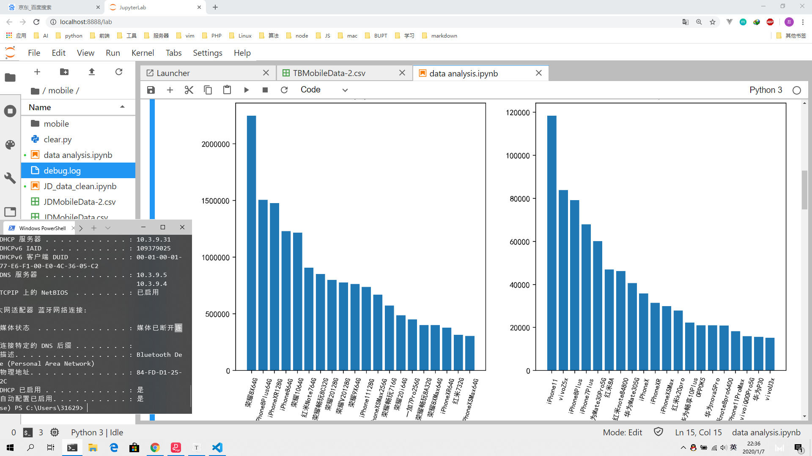

# Python数据获取、清理和可视化


## 任务要求

- 分别爬取京东和淘宝，在手机频道中，找出累积销量（所有商家销售同一型号手机的销量之和）最高的 20 款手机。高级版本需要区分具体型号。
- 用你爬取下来的数据制作散点图，横轴为手机价格，纵轴为该价格对应的商家个数
- 找出在两个平台上都有售卖的 5 款手机（找销量较大的），由于两个平台上都有不同的卖家都销售这些手机，价格也不同，需要将这些卖家销售这款手机的价格，做出箱型图，比较不同平台上的价格情况


## 环境

1. win10
2. miniconda
3. vscode
4. jupyter


## 数据获取

### 爬取目标

需要爬取京东和淘宝的手机类别的相关信息，包括商店名称、手机型号、销量以及价格。对于京东，销量用用户评价的数量代替，对于淘宝，销量用用户付款数代替。

因此，定义下面的字段用于存储爬取到信息

- store：保存商店名称
- name：保存手机型号
- sales：保存销量
- price：保存价格


针对爬取目标，京东可以获取某款手机不同配置的具体评论数量，而淘宝无法获得不同配置自己的付款人数，因而对于淘宝来说高级版本意义不大。基于此，本次爬取京东高级版本，爬取淘宝基础版本。

### 爬取京东

#### 定义item

将上述分析的字段转为scrapy的字段类型

```python
import scrapy

class MobileItem(scrapy.Item):
    store = scrapy.Field()
    name = scrapy.Field()
    sales = scrapy.Field()
    price = scrapy.Field()
    
```

#### 定义pipeline

将爬取的条目保存为csv文件

```python
import csv
class MobilePipeline(object):
    def open_spider(self, spider):
        try:
            self.file = open('JDMobileData.csv', 'w', newline='',encoding='utf-8')
        except Exception as err:
            print(err)
        self.w = csv.writer(self.file)
        self.w.writerow(['store', 'name', 'sales', 'price'])

    def process_item(self, item, spider):
        
        self.w.writerow([item['store'], item['name'], item['sales'], item['price']])
        return item
    
    def close_spider(self, spider):
        self.file.close()
```

#### 定义spider

对于京东的商品，只要有一个参数不同，京东的商品id就会不同，因此需要爬取每款手机每种配置的商品id，进而获取其评论数和价格

爬取共分为三个步骤

1. 在商品搜索页，获得每款手机的不同颜色的商品id，根据id构造商品详情页id，进而爬取商品详情页信息
2. 在商品详情页，获得当前页面不同配置的商品id
3. 在得到所有id后，调用京东的评论和价格接口，传入id得到该id对应的价格和评论数

#### 爬取商品搜索页

经过尝试，商品搜索页的后30个商品是异步加载的，但是在url加上`scrolling=y`时就不会触发异步加载，同时每页返回30个商品


观察到这里每一个图片都对应一个`data-sku`即商品id


其对于的选择器是`li.ps-item a img::attr(data-sku)`，此时只需要爬取此页面所有的`data-sku`，代码如下

```python
def parse(self, response):
    # ids = response.css('li.gl-item::attr(data-sku)').getall()
    ids = response.css('li.ps-item a img::attr(data-sku)').getall()
    for id in ids:
        url = 'https://item.jd.com/{}.html'.format(id) # 根据id构造详情页网址
        yield scrapy.Request(url=url, callback=self.parse_detail)

     self.page_num = self.page_num + 1
     next_url = 'https://search.jd.com/search?keyword=%E6%89%8B%E6%9C%BA&enc=utf-8&qrst=1&rt=1&stop=1&vt=2&wq=%E6%89%8B%E6%9C%BA&cid2=653&cid3=655&page={}&s={}&click=0&scrolling=y'.format(self.page_num, (1+(self.page_num-1)*30))
     if self.page_num <= 100:
        yield scrapy.Request(url=next_url, callback=self.parse)
```

#### 爬取商品详情页


此处可以查找所有不同版本的商品id


同时`data-value`可以得到版本信息。在得到所有的商品id后就可以请求接口得到价格和评论数了，然后就可以保存该条目。接口信息可以在浏览器检查工具删选得到，具体接口见下面的代码。

```python
def parse_detail(self, response):
    name = response.css('ul.parameter2.p-parameter-list > li:nth-child(1)::attr(title)').get()
    store = response.css('#popbox > div > div.mt > h3 > a::attr(title)').get()
    ids = response.css('#choose-attr-2 > div.dd > div.item::attr(data-sku)').getall()
    values = response.css('#choose-attr-2 > div.dd > div.item::attr(data-value)').getall()
    for id, value in zip(ids, values):
        item = MobileItem()
        r = requests.get('https://p.3.cn/prices/mgets?skuIds=J_{}'.format(id))
        data = r.json()
        item['name'] = name + '#' + str(value)
        item['store'] = store
        item['price'] = data[0]['p']
        url = 'https://club.jd.com/comment/skuProductPageComments.action?productId={}&score=0&sortType=5&page=0&pageSize=10&isShadowSku=0&fold=1'.format(id)
        headers = {
            'referer': 'https://item.jd.com/{}.html'.format(id)
        }
        r = requests.get(url, headers=headers)
        data = r.json()
        item['sales'] = data['productCommentSummary']['commentCount']
        yield item
```

#### 查看爬取结果


共爬取**14335**条信息，前十条结果如下

```
store,name,sales,price
荣耀京东自营旗舰店,华为荣耀20S#全网通（6GB 128GB）,94928,1489.00
荣耀京东自营旗舰店,华为荣耀20S#全网通（8GB 128GB）,6758,1989.00
vivo京东自营官方旗舰店,vivoZ5x#4GB+64GB,11779,1298.00
vivo京东自营官方旗舰店,Z5x#4GB+64GB,11779,1298.00
荣耀京东自营旗舰店,华为荣耀20i#全网通（6GB 64GB）,188910,989.00
vivo京东自营官方旗舰店,vivoZ5x#6GB+64GB,63903,1298.00
荣耀京东自营旗舰店,华为神秘手机#全网通（6GB 64GB）,143331,989.00
vivo京东自营官方旗舰店,Z5x#6GB+64GB,66678,1298.00
荣耀京东自营旗舰店,华为荣耀20i#全网通（6GB 64GB）,119780,989.00
荣耀京东自营旗舰店,华为荣耀20i#全网通（6GB 64GB）,143331,989.00
```


### 爬取淘宝

淘宝具有很强的反爬措施，而且需要登录，因此采用selenium自动化测试工具模拟人为操作浏览器，在进行一定的操作后，将浏览器的当前页面的源代码传给分析工具分析，本次使用lxml库的etree工具提取信息。

下面是爬取代码，登录采用扫码登录，为了防止反爬，此处采取降低爬取效率，在每一步操作后，进行足够量的sleep操作，以保证不被放入淘宝的黑名单中。

一旦获得了页面的源代码，就可以提取出需要的信息，此处和爬取京东分析方式类似，此处略过。

同时在爬取过程中，就进行一定的数据清洗过程。尤其是爬取name字段的时候，会出现很多无效的转义字符和标点符号，在写入文件前，就将其去除。

```python
'''
@Description: 爬取淘宝
@Autor: khuqen
@Date: 2020-01-07 09:58:33
@LastEditors  : khuqen
@LastEditTime : 2020-01-07 22:01:20
'''
from selenium import webdriver
from selenium.webdriver.common.keys import Keys
from lxml import etree
import time
import csv

file = open('TBMobileData.csv', 'w', newline='',encoding='utf-8')
w = csv.writer(file)
w.writerow(['store', 'name', 'sales', 'price'])

# 爬取手机类别
things = "手机"
driver = webdriver.Chrome()
driver.implicitly_wait(5)
driver.get('https://login.taobao.com/member/login.jhtml')

# 等待扫码登录
time.sleep(10)
def scan_login():
    #跳过滑动验证
    chrome_option = webdriver.ChromeOptions()
    chrome_option.add_argument('--proxy--server=127.0.0.1:8080')#使用代理IP,告诉服务器这是人为操作

    search = driver.find_element_by_xpath('//*[@id="q"]') #在kw内输入
    search.send_keys(things)#获取输入的商品
    time.sleep(2)
    search.send_keys(Keys.ENTER)#按回车 
    time.sleep(4)#大约加载4秒
    maxPage = driver.find_element_by_xpath('//*[@id="mainsrp-pager"]/div/div/div/div[1]').text #查找到商品的最大页数
    print ("您所查询的商品",maxPage)

def start(starPage,endPage):#选择商品页数片段
    for num in range(starPage,endPage+1):        
        print ("正在准备爬取第%s页"%num)
        js="document.documentElement.scrollTop=4950"#下拉加载
        driver.execute_script(js)
        driver.implicitly_wait(5)
        search = driver.find_element_by_xpath('//*[@id="mainsrp-pager"]/div/div/div/div[2]/input')#获取输入页数框
        time.sleep(4)
        try:
            search.clear()#清空内容
        except:
            search = driver.find_element_by_xpath('//*[@id="mainsrp-pager"]/div/div/div/div[2]/input')#获取输入页数框
            search.clear()#清空内容
        time.sleep(1)
        search.send_keys(num)
        time.sleep(3)
        spider()
        if num < endPage:#当输入页数小于终止页时可以跳转到下一页
            nextPage()
def nextPage():
        driver.find_element_by_xpath('//*[@id="mainsrp-pager"]/div/div/div/div[2]/span[3]').click()#点击确定，跳转页数

def spider():
    time.sleep(5)
    source = driver.page_source#获取网页源码
    html = etree.HTML(source)#解析源网页
    for et in html.xpath('//*[@id="mainsrp-itemlist"]/div/div/div[1]/div'):
        names = et.xpath('./div[2]/div[2]/a/text()')
        name = (str(names)).replace(" ","").replace("'","").replace(",","").replace("[\\n\\n\\n\\n","").replace("\\n]","").replace("[\\n\\n","")
        #//   双斜杠可以表明转译符
        price = et.xpath('./div[2]/div/div/strong/text()')[0]
        try:
            sales = et.xpath('./div[2]/div[1]/div[2]/text()')[0]
        except:
            continue
        store = et.xpath('./div[2]/div[3]/div[1]/a/span[2]/text()')[0]
        w.writerow([store, name, sales, price])
        print (store, name, sales, price, '\n')
        
if __name__ == '__main__':
    scan_login()
    starPage = int(input("请输入起始页数字："))
    endPage = int(input("请输入终止页数字："))
    start(starPage,endPage)
```

#### 查看爬取信息


共爬取**4406**条信息，前10条如下：

```
store,name,sales,price
vivo官方旗舰店,vivoZ5x极点全面屏高通骁龙710大电池智能官方正品新品vivoz5x限量版z3x,2.5万+人付款,1198.00
京合旗舰店,直降200元【当天发】Huawei/华为畅享10plus官方旗舰店畅想9plus新款nova5pro正品5i学生5g荣耀9x,3267人付款,1199.00
荣耀官方旗舰店,【优惠高达600元】华为旗下HONOR/荣耀20i3200万AI自拍渐变色官方旗舰店珍珠全面屏正品学生,9000+人付款,999.00
vivo官方旗舰店,vivoZ5x极点全面屏高通骁龙710大电池智能官方正品新品vivoz5x限量版z3x,2.5万+人付款,1198.00
荣耀官方旗舰店,【限时低至1099】华为旗限时低至1099元下HONOR/荣耀9X麒麟810芯片4800万超清双摄官方旗舰店全新正品,5.0万+人付款,1099.00
华为官方旗舰店,【年货节24期免息】Huawei/华为Mate30Pro5G麒麟990徕卡四摄5G芯片智能mate30pro5g官方旗舰店,3.0万+人付款,6399.00
vivo官方旗舰店,【至高省800享24期免息】vivoiQOOPro5G高通骁龙855Plus处理器游戏指纹新品iqooprovivoiqoo限量版,6500+人付款,3298.00
小米官方旗舰店,【全版本立省100】红米8A大电量大屏幕智能游戏学生老年人小米官方旗舰店官网redmi红米8a正品,2.5万+人付款,599.00
华为官方旗舰店,【年货节24期免息】Huawei/华为Mate305G麒麟990超感光徕卡三摄5G智能mate305g官方旗舰店,2.0万+人付款,4999.00
喜洋洋工作屋,Apple/苹果iPhone7PlusiPhone7国行三网通全新正品苹果7P,1.0万+人付款,2160.00
```


## 数据清洗

爬取的信息太过驳杂，必须加以清洗才可以使用。主要表现在：

- 手机型号的名字太过混乱
- 淘宝爬取的手机销量含有中文，并且单位不一致
- 需要把价格信息转为整形，方便分析


### 清洗京东数据

清洗的难点主要在于手机名称过于驳杂，对此，观察爬取到的数据，发现大部分数据的真实名称都是品牌名加英文或者数字，直至出现下一个中文符号。对于京东的数据，还需清理版本名字，这里使用正则查找数字紧着`G`的字串，取最后一个即为清洗后的版本

因此，定义以下辅助清洗函数

```python
def is_Chinese(word):
    for ch in word:
        if '\u4e00' <= ch <= '\u9fff':
            return True
    return False
def is_letter_or_digit(ch):
    return (ch >= 'a' and ch <= 'z') or  (ch >= 'A' and ch <= 'Z') or (ch >= '0' and ch <= '9')

def clearName(names):
    items = names.split('#')
    r = re.findall(r'\d+G', items[1])
    origin_name = items[0].replace(' ', '')
    if len(r) >= 1:
        r = r[-1]
    else:
        return None
    
    brands = ['AppleiPhone', '荣耀', 'Huawei/华为', '红米', 'Xiaomi/小米', 'vivo', 'OPPO', '一加', '魅族', 'realme', '锤子', '中兴']
    idx = -1
    start = -1
    for brand in brands:
        idx = origin_name.find(brand)
        if idx != -1:
            start = idx
            idx = idx + len(brand)
            break
    if idx == -1:
        return None
    while idx < len(origin_name) and is_Chinese(origin_name[idx]):
        idx = idx + 1
    while idx < len(origin_name) and is_letter_or_digit(origin_name[idx]):
        idx = idx + 1
    return origin_name[start:idx] + ' ' + r
```

清洗过程，需要先去除一些特殊情况以便更好的清理。

```python
file = open('JDMobileData.csv', 'r', encoding='utf8')
lines = file.readlines()
f = open('JDMobileData-2.csv', 'w', encoding='utf8', newline='')
w = csv.writer(f)
w.writerow(['store', 'name', 'sales', 'price'])
for line in lines[1:]:
    store,name, sales, price = line.split(',')
    price = int(float(price[:-1]))
    name = name.replace('（HUAWEI）', '').replace('（MI）', '').replace('小米小米', '小米').replace('（MEIZU）', '').replace('魅族魅族', '魅族')
        .replace('一加一加', '一加').replace('realmerealme ', 'realme').replace('（smartisan）', '').replace('vivovivo', 'vivo')
    name = clearName(name)
    if name:
        w.writerow([store, name, sales, price])
f.close()
```

清洗结果如下：


前十条数据如下

```
store,name,sales,price
荣耀京东自营旗舰店,荣耀20S 128G,94928,1489
荣耀京东自营旗舰店,荣耀20S 128G,6758,1989
vivo京东自营官方旗舰店,vivoZ5x 64G,11779,1298
荣耀京东自营旗舰店,荣耀20i 64G,188910,989
vivo京东自营官方旗舰店,vivoZ5x 64G,63903,1298
荣耀京东自营旗舰店,荣耀20i 64G,119780,989
荣耀京东自营旗舰店,荣耀20i 64G,143331,989
vivo京东自营官方旗舰店,vivoZ5x 64G,11779,1298
荣耀京东自营旗舰店,荣耀20i 128G,22233,1289
```


### 清洗淘宝数据

思路和清洗京东的数据一样，先定义一些品牌名，然后直到遇到新的中文字符，得到的字符串就是可以使用的手机型号名。品牌名需要根据数据特点进行定制。

```python
def is_Chinese(word):
    for ch in word:
        if '\u4e00' <= ch <= '\u9fff':
            return True
    return False
def is_letter_or_digit(ch):
    return (ch >= 'a' and ch <= 'z') or  (ch >= 'A' and ch <= 'Z') or (ch >= '0' and ch <= '9')

def clearName(origin_name):
    brands = ['Apple/苹果', 'honor/荣耀', 'Huawei/华为', '红米', 'Xiaomi/小米', 'vivo', 'OPPO', '一加', 'Meizu/魅族', 'realme', '锤子', '中兴']
    idx = -1
    start = -1
    for brand in brands:
        idx = origin_name.find(brand)
        if idx != -1:
            start = idx
            idx = idx + len(brand)
            break
    if idx == -1:
        return None
    while idx < len(origin_name) and is_Chinese(origin_name[idx]):
        idx = idx + 1
    while idx < len(origin_name) and is_letter_or_digit(origin_name[idx]):
        idx = idx + 1
    return origin_name[start:idx]
```

清洗过程，此处需要额外清洗销量数据，提取数字，并统一单位。

```python
file = open('TBMobileData.csv', 'r', encoding='utf8')
lines = file.readlines()
f = open('TBMobileData-2.csv', 'w', encoding='utf8', newline='')
w = csv.writer(f)
w.writerow(['store', 'name', 'sales', 'price'])
for line in lines[1:]:
    store, name, sales, price = line.split(',')
    price = int(float(price[:-1]))
    name = name.replace('苹果Apple', '苹果').replace('荣耀荣耀', '荣耀').replace('小米小米', '小米').replace('iPhone7PlusiPhone7', 'iPhone7Plus')
    name = clearName(name)
    number = re.findall(r'\d+', sales)
    if len(number) > 0:
        number = int(number[0])
    else:
        continue
    if '万' in sales:
        number = number * 10000
    if name:
        w.writerow([store, name, number, price])
f.close()
```

清洗结果如下：


前十行数据如下：

```
store,name,sales,price
vivo官方旗舰店,vivoZ5x,20000,1198
京合旗舰店,Huawei/华为畅享10plus,3267,1199
vivo官方旗舰店,vivoZ5x,20000,1198
华为官方旗舰店,Huawei/华为Mate30Pro5G,30000,6399
vivo官方旗舰店,vivoiQOOPro5G,6500,3298
小米官方旗舰店,红米8A,20000,599
华为官方旗舰店,Huawei/华为Mate305G,20000,4999
喜洋洋工作屋,Apple/苹果iPhone7Plus,10000,2160
樱公爵,Apple/苹果iPhone8Plus,2143,1970
苏宁易购官方旗舰店,Huawei/华为P30,2212,3388
```


## 数据展示

使用下列库，进行数据展示

```python
import numpy as np
import pandas as pd
import matplotlib.pyplot as plt
%matplotlib inline
plt.rcParams['font.sans-serif'] = ['SimHei'] #用来正常显示中文标签
```

读入数据，以便进行后续分析

```python
# 读入数据
jd = pd.read_csv('JDMobileData-2.csv')
tb = pd.read_csv('TBMobileData-2.csv')
```

### 绘制销量直方图

#### 统计销量

```python
# 统计销量
jd_n = jd.groupby(['name']).sum()
jd_n = jd_n.sort_values('sales', ascending=False)
jd_n = jd_n[:20] # 找出销量前20名

tb_n = tb.groupby(['name']).sum()
tb_n = tb_n.sort_values('sales', ascending=False)
tb_n = tb_n[:20] # 找出销量前20名
```

#### 求出x轴标签

x轴标签即20款手机的名称，此处进行适当的删除保证名字长度合适

```python
xlabels = []
for x in jd_n.index:
    x = x.replace('Apple', '')
    x = x.replace(' ', '')
    xlabels.append(x)
ylabels = []
for x in tb_n.index:
    x = x.replace('Apple/', '').replace('Huawei/', '').replace('苹果', '')
    ylabels.append(x)
```

#### 绘制直方图

```python
fig, ax = plt.subplots(figsize=(12,6), dpi=200)
ax.set_visible(False)
ax1 = fig.add_subplot(121)
ax2 = fig.add_subplot(122)
x = range(1, 21)
y1 = jd_n['sales']
ax1.set_title("京东")
ax1.set_xticks([x for x in range(1, 21)])
ax1.set_xticklabels(xlabels, rotation=75, fontsize="small")
ax1.bar(x, y1)
y2 = tb_n['sales']
ax2.set_title("淘宝")
ax2.set_xticks([x for x in range(1, 21)])
ax2.set_xticklabels(ylabels, rotation=75, fontsize="small")
ax2.bar(x, y2)
plt.show()
```




### 绘制价格商家数散点图

#### 统计价格对应的商家数

```python
# 价格对应的商家数
jd_p = jd.groupby(['price']).count()
tb_p = tb.groupby(['price']).count()
```

#### 绘制散点图 

```python
# 绘制散点图 
fig, ax = plt.subplots(figsize=(12,6), dpi=200)
ax.set_visible(False)
ax1 = fig.add_subplot(121)
ax2 = fig.add_subplot(122)
ax1.set_title("京东")


y1 = jd_p['store']
ax1.set_title("京东")
ax1.scatter(jd_p.index, y1)
y2 = tb_p['store']
ax2.set_title("淘宝")
ax2.scatter(tb_p.index, y2)
plt.show()
```


### 绘制价格箱型图

#### 获取5款手机两个平台的价格

````python
jd_1 = jd[jd.name == '荣耀8X 64G']['price']
tb_1 = tb[tb.name == 'honor/荣耀8X']['price']
jd_2 = jd[jd.name == 'AppleiPhone11 128G']['price']
tb_2 = tb[tb.name == 'Apple/苹果iPhone11']['price']
jd_3 = jd[jd.name == '红米K20pro 128G']['price']
tb_3 = tb[tb.name == '红米k20pro']['price']
jd_4 = jd[jd.name == 'vivoU3x 32G']['price']
tb_4 = tb[tb.name == 'vivoU3x']['price']
jd_5 = jd[jd.name == 'vivoiQOOPro5G 128G']['price']
tb_5 = tb[tb.name == 'vivoiQOOPro5G']['price']
````

#### 绘制箱型图

```python
# 绘制箱型图
fig, ax = plt.subplots(figsize=(15,6), dpi=200)
ax.set_visible(False)
ax1 = fig.add_subplot(151)
ax1.set_title('荣耀8X')
ax1.boxplot([jd_1, tb_1])
ax2 = fig.add_subplot(152)
ax2.set_title('iPhone11')
ax2.boxplot([jd_2, tb_2])
ax3 = fig.add_subplot(153)
ax3.set_title('红米K20pro')
ax3.boxplot([jd_3, tb_3])
ax4 = fig.add_subplot(154)
ax4.set_title('华为nova5Pro')
ax4.boxplot([jd_4, tb_4])
ax5 = fig.add_subplot(155)
ax5.set_title('vivoiQOOPro5G')
ax5.boxplot([jd_5, tb_5])
plt.show()
```

